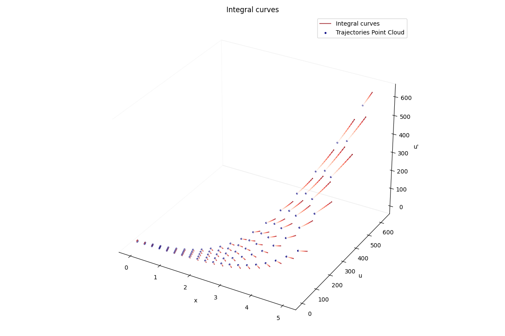

# Symmetry Detection from Point Cloud

We present a novel framework for detecting Lie symmetry groups present in a noisy point cloud, typically data gathered from physical systems with clearly defined N-th order derivatives. By detecting the underlying symmetry groups, we uncover the entire solution manifold, enabling systemic behaviour prediction.

#### Example of solution manifold discovery from a 5-trajectory point cloud:

Developed by: Stef Nam Nguyen, supervised by: Dr. Andrew Lawrie
Queen's Building, University of Bristol, BS8 1TR, UK
